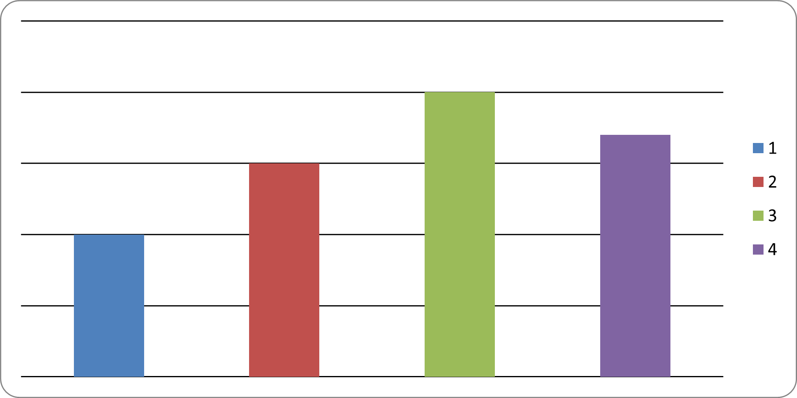
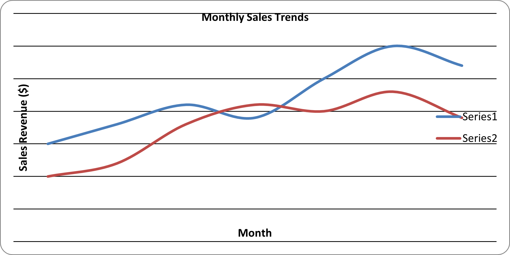
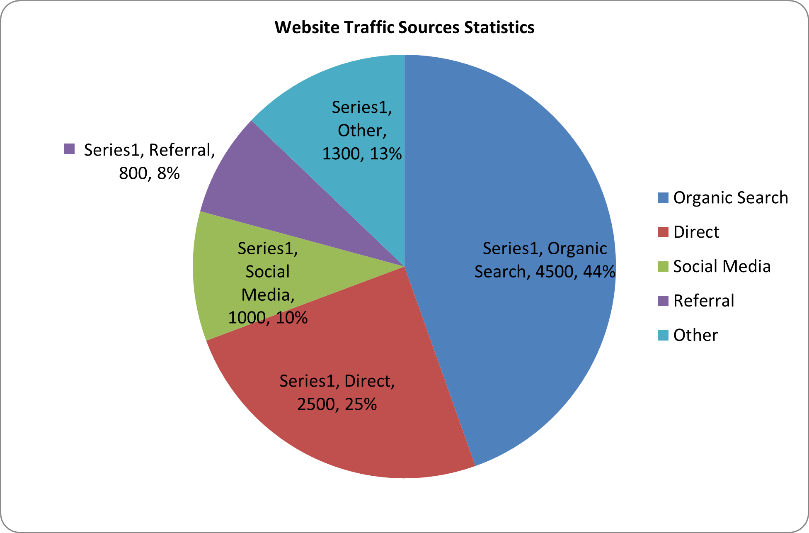
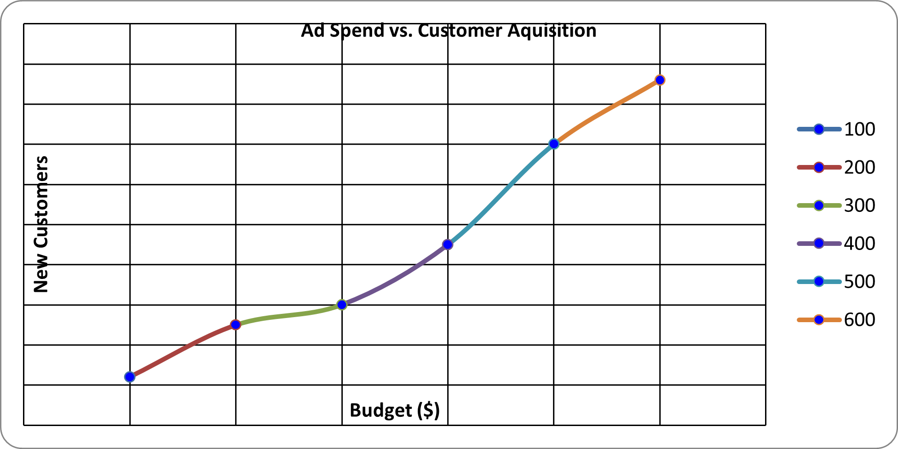

# openpyxl - 5. Charts and Graphs

- [openpyxl - 5. Charts and Graphs](#openpyxl---5-charts-and-graphs)
  - [5.1 Creating Charts (Sample: 1) Bar Chart)](#51-creating-charts-sample-1-bar-chart)
  - [5.2 Chart Types](#52-chart-types)
    - [2) Line Chart](#2-line-chart)
    - [3) Pie Chart](#3-pie-chart)
    - [4) Scatter Chart](#4-scatter-chart)
    - [5) Area Chart](#5-area-chart)
    - [6) Radar Chart](#6-radar-chart)
    - [7) Doughnut Chart (within Pie Chart)](#7-doughnut-chart-within-pie-chart)
    - [8) Stock Chart](#8-stock-chart)
  - [5.3 Customizing Charts](#53-customizing-charts)
  - [5.4 Adding Charts to Worksheets](#54-adding-charts-to-worksheets)

## 5.1 Creating Charts (Sample: 1) Bar Chart)

```python
from openpyxl import Workbook
from openpyxl.chart import BarChart, Reference

workbook = Workbook()
sheet = workbook.active

# Prepare Data
data = [
    ['Category', 'Value'],
    ['A', 10],
    ['B', 15],
    ['C', 20],
    ['D', 17]
]

# Adding Data into worksheet
for row in data:
    sheet.append(row)

# Create Chart Data Reference
chart_data = Reference(
    sheet,
    min_col = 2,
    max_col = 2,
    min_row = 2,
    max_row = 5
)

# Create Bar Chart
my_chart = BarChart()
my_chart.add_data(chart_data)

# Add Chart into Worksheet
sheet.add_chart(my_chart, "D1")

workbook.save("bar_chart_sample.xlsx")
```



Source code reference:

- `openpyxl.chart` module: https://foss.heptapod.net/openpyxl/openpyxl/-/tree/branch/default/openpyxl/chart
- `chart/bar_chart.py`: https://foss.heptapod.net/openpyxl/openpyxl/-/blob/branch/default/openpyxl/chart/bar_chart.py

## 5.2 Chart Types

### 2) Line Chart

```python
from openpyxl import Workbook
from openpyxl.chart import LineChart, Reference

# 0. Initialize WorkBook and WorkSheet

workbook = Workbook()
sheet = workbook.active
sheet.title = "Sales Report"

# 1. Prepare the Data

rows = [
    ["Month", "Online Sales", "InStore Sales"],
    ["Jan", 150, 100],
    ["Feb", 180, 120],
    ["Mar", 210, 180],
    ["Apr", 190, 210],
    ["May", 250, 200],
    ["Jun", 300, 230],
    ["Jul", 270, 190],
]

for row in rows:
    sheet.append(row)

# 2. Initialize the Chart - Line Chart

myChart = LineChart()
myChart.title = "Monthly Sales Trends"
myChart.x_axis.title = "Month"
myChart.y_axis.title = "Sales Revenue ($)"

# 3. Define the Data (Column B and C)

myData = Reference(sheet, min_col=2, max_col=3, min_row=2, max_row = 8)
myChart.add_data(myData)

# 4. Define Categories (Column A)

myCats = Reference(sheet, min_col=1, min_row=2, max_row=8)
myChart.set_categories(myCats)

# 5. Add chart into the sheet

sheet.add_chart(myChart, "E2")

# 6. Save workbook

workbook.save("Line_Chart_Sample.xlsx")
```



Source code reference:

- `chart/line_chart.py`: https://foss.heptapod.net/openpyxl/openpyxl/-/blob/branch/default/openpyxl/chart/line_chart.py

### 3) Pie Chart

```python
from openpyxl import Workbook
from openpyxl.chart import PieChart, Reference
from openpyxl.chart.label import DataLabelList

# 0. Initialize WorkBook and WorkSheet

workbook = Workbook()
sheet = workbook.active
sheet.title = "Traffic Data"

# 1. Prepare the Data

rows = [
    ["Source", "Visitors"],
    ["Organic Search", 4500],
    ["Direct", 2500],
    ["Social Media", 1000],
    ["Referral", 800],
    ["Other", 1300]
]

for row in rows:
    sheet.append(row)

# 2. Initialize the Chart - Pie Chart

myChart = PieChart()
myChart.title = "Website Traffic Sources Statistics"

# 3. Define the Data (Column B)

myData = Reference(sheet, min_col=2, max_col=2, min_row=2, max_row = 6)
myChart.add_data(myData, titles_from_data = False)

# 4. Define Categories (Column A)

myCats = Reference(sheet, min_col=1, max_col=1, min_row=2, max_row=6)
myChart.set_categories(myCats)

# Optional: add Percent Labels

myChart.dataLabels = DataLabelList()
myChart.dataLabels.showPercent = True
myChart.dataLabels.showCategoryname = False

# 5. Add chart into the sheet

sheet.add_chart(myChart, "D2")

# 6. Save workbook

workbook.save("Pie_Chart_Sample.xlsx")
print("Pie Chart generated successfully!")
```



Source code reference:

- `chart/pie_chart.py`: https://foss.heptapod.net/openpyxl/openpyxl/-/blob/branch/default/openpyxl/chart/pie_chart.py

### 4) Scatter Chart

```python
from openpyxl import Workbook
from openpyxl.chart import Reference, ScatterChart, Series

# 0. Initialize Workbook & Worksheet

workbook = Workbook()
sheet = workbook.active

# 1. Preparation of the Data

sheet.title = "Scatter Data"

data = [
    ["Ad Spend", "New Customer"],
    [100, 12],
    [200, 25],
    [300, 30],
    [400, 45],
    [500, 70],
    [600, 86]
]

# 2. Add data into Worksheet

for row in data:
    sheet.append(row)

# 3. Initialize Chart: Scatter Chart

myChart = ScatterChart()
myChart.title = "Ad Spend vs. Customer Aquisition"
myChart.x_axis.title = "Budget ($)"
myChart.y_axis.title = "New Customers"
# myChart.style = 15
myChart.scatterStyle = "marker"

# 4. Define X & Y Reference

xValues = Reference(sheet, min_col=1, max_col=1, min_row=2, max_row=7)
yValues = Reference(sheet, min_col=2, max_col=2, min_row=2, max_row=7)

# 5. Create Series object to Link X and Y

mySeries = Series(yValues, xValues, title = "Acquisition Rate")
myChart.series.append(mySeries)

# Optional: Markers

mySeries.marker.symbol = "circle"
mySeries.marker.graphicalProperties.solidFill = "0000FF"

# Add the Chart to the Worksheet

sheet.add_chart(myChart, "D2")

# Save the file

workbook.save("Scatter_Chart_Sample.xlsx")
print("Scatter Chart generated successfully!")
```



Source code reference:

- `chart/scatter_chart.py`: https://foss.heptapod.net/openpyxl/openpyxl/-/blob/branch/default/openpyxl/chart/scatter_chart.py

### 5) Area Chart

```python
```

Source code reference:

- `chart/area_chart.py`: https://foss.heptapod.net/openpyxl/openpyxl/-/blob/branch/default/openpyxl/chart/area_chart.py

### 6) Radar Chart

```python
```

Source code reference:

- `chart/radar_chart.py`: https://foss.heptapod.net/openpyxl/openpyxl/-/blob/branch/default/openpyxl/chart/radar_chart.py

### 7) Doughnut Chart (within Pie Chart)

```python
```

Source code reference:

- `DoughnutChat(_PieChartBase)`: https://foss.heptapod.net/openpyxl/openpyxl/-/blob/branch/default/openpyxl/chart/pie_chart.py#L89

### 8) Stock Chart

```python
```

Source code reference:

- `chart/stock_chart.py`: https://foss.heptapod.net/openpyxl/openpyxl/-/blob/branch/default/openpyxl/chart/stock_chart.py

## 5.3 Customizing Charts

```python
```

## 5.4 Adding Charts to Worksheets

```python
```

---

Last Updated at: 12/31/2025, 10:02:48 PM  