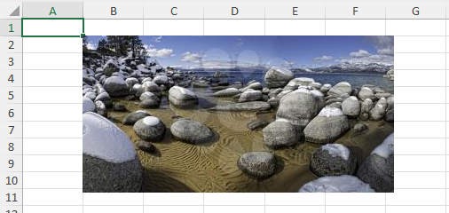
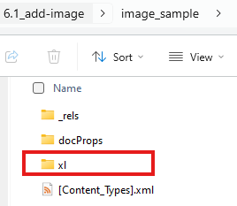
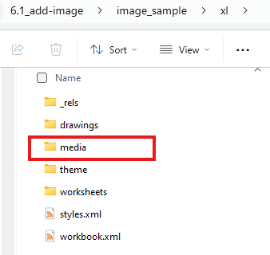
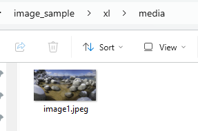

# openpyxl - 6. Images and Drawings

- [openpyxl - 6. Images and Drawings](#openpyxl---6-images-and-drawings)
  - [6.1 Adding Images to Worksheets](#61-adding-images-to-worksheets)
  - [6.2 Working with Drawing Objects](#62-working-with-drawing-objects)
  - [6.3 Resizing and Positioning Images](#63-resizing-and-positioning-images)
  - [6.4 Image Formats](#64-image-formats)

## 6.1 Adding Images to Worksheets

Adding images to worksheets uses the `openpyxl.drawing.image` module, you need to indicate the path of your image file, support `gif`, `jpeg` and `png` formats.

If you don't input the location of the image in worksheet, it's by default from `anchor = "A1"`, check source code for detail.

```python
from openpyxl import Workbook
from openpyxl.drawing.image import Image

workbook = Workbook()
sheet = workbook.active

img = Image("my_image.jpg")

sheet.add_image(img, "B2")

workbook.save("image_sample.xlsx")
```



Image Source: https://clipart.com/

Source Code Reference:

- `drawing/image.py`: https://foss.heptapod.net/openpyxl/openpyxl/-/blob/branch/default/openpyxl/drawing/image.py

Extended information: treat `xlsx` as `zip`, you can extract the excel file after renaming its extension to `zip`, then following are the structure and we can see our image file is saved under the sub-folder:

| Level 1 | Level 2 | Level 3 |
| --- | --- | --- |
|  |  |  |

## 6.2 Working with Drawing Objects

Images and other drawing objects in openpyxl are represented as `Drawing` objects.

Source Code Reference:

- `drawing/drawing.py`: https://foss.heptapod.net/openpyxl/openpyxl/-/blob/branch/default/openpyxl/drawing/drawing.py

## 6.3 Resizing and Positioning Images

```python
from openpyxl import Workbook
from openpyxl.drawing.image import Image
from openpyxl.utils.units import pixels_to_EMU

workbook = Workbook()
sheet = workbook.active

img = Image("my_image.jpg")
drawing = sheet.add_image(img, "B2")

# Resizing the image (in EMUs)
img.width= 200
img.height = 150

# Reposition the image (in EMUs) ?
img.left= pixels_to_EMU(500)
img.top = pixels_to_EMU(50)

workbook.save("drawing_sample.xlsx")
```

Source Code Reference:

- `pixels_to_EMU`: https://foss.heptapod.net/openpyxl/openpyxl/-/blob/branch/default/openpyxl/utils/units.py#L62

Open Questions:

1. The `width` and `height` properties are not to drawing object, but to `Image` object
2. No effect of `left` and `top` property during testing.

## 6.4 Image Formats

openpyxl supports various image formats, including PNG, JPEG, GIF, and others. The specific formats supported depend on the underlying libraries used by openpyxl (usually Pillow). If you encounter issues with a specific format, check your Pillow installation and ensure it supports that format. PNG is generally recommended for lossless image quality.

---

Last Updated at: 1/2/2026, 10:20:42 AM  