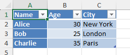

# openpyxl - 7. Working with Tables

- [openpyxl - 7. Working with Tables](#openpyxl---7-working-with-tables)
  - [7.1 Creating Tables](#71-creating-tables)
  - [7.2 Formatting Tables](#72-formatting-tables)
  - [7.3 Working with Table Data](#73-working-with-table-data)
  - [7.4 Filtering and Sorting](#74-filtering-and-sorting)

## 7.1 Creating Tables

openpyxl provides functionality to work with Excel tables (also known as `ListObjects`).

Creating a table involves specifying a range of cells and optionally providing a table name.

```python
from openpyxl import Workbook
from openpyxl.worksheet.table import Table, TableStyleInfo

workbook = Workbook()
sheet = workbook.active

# Prepare Data
data = [
    ["Name", "Age", "City"],
    ["Alice", 30, "New York"],
    ["Bob", 25, "London"],
    ["Charlie", 35, "Paris"]
]

for row in data:
    sheet.append(row)

# Create Table
table = Table(displayName="MyTable", ref="A1:C4")

# Define a table style
style = TableStyleInfo(
    name = "TableStyleMedium9",
    showFirstColumn=True,
    showLastColumn=False,
    showRowStripes=True,
    showColumnStripes=True
)
table.tableStyleInfo = style

# Add the table to the worksheet
sheet.add_table(table)

workbook.save("create_table_sample.xlsx")
```



Source Code Reference:

- `worksheet/table.py`: https://foss.heptapod.net/openpyxl/openpyxl/-/blob/branch/default/openpyxl/worksheet/table.py

## 7.2 Formatting Tables

Table formatting involves applying styles to the table’s appearance, such as header row styles, banded rows, total row, etc.

This is done by modifying the tableStyleInfo attribute of the Table object. You can choose from predefined styles or create custom styles.

```python
from openpyxl import Workbook
from openpyxl.worksheet.table import Table, TableStyleInfo

workbook = Workbook()
sheet = workbook.active

# Prepare Data
data = [
    ["Name", "Age", "City"],
    ["Alice", 30, "New York"],
    ["Bob", 25, "London"],
    ["Charlie", 35, "Paris"]
]

for row in data:
    sheet.append(row)

# Create Table
table = Table(displayName="MyTable", ref="A1:C4")

# Define a table style
custom_style = TableStyleInfo(
    name = "TableStyleMedium9",
    showFirstColumn=True,
    showLastColumn=False,
    showRowStripes=True,
    showColumnStripes=True,
    # pivotButton=True  # no more this option
)

custom_style.font = "Arial,20"
custom_style.fill = {
    "type": "solid",
    "fgColor": "FFFFCC"
}

table.tableStyleInfo = custom_style

# Add the table to the worksheet
sheet.add_table(table)

workbook.save("custom_table_style.xlsx")

# 2025/01/12: the custom style is not effective, need further investigation
```

Source Code Reference:

- `TableStyleInfo`: https://foss.heptapod.net/openpyxl/openpyxl/-/blob/branch/default/openpyxl/worksheet/table.py#L41

## 7.3 Working with Table Data

Accessing and modifying data within a table is similar to working with regular cells.

- You can directly access cells using their coordinates or iterate through rows and columns.
- Adding rows usually appends to the end of the table.
- Deleting rows or columns requires careful handling of the table’s structure and might need updating the table’s reference range using table.ref.

```python
from openpyxl import load_workbook

workbook = load_workbook("table_sample.xlsx")
sheet = workbook.active
table = sheet["MyTable"]

# Accessing a specific cell in a table
cell_value = table["A2"].value
print(f"Value of A2: {cell_value}")

workbook.save("updated_table.xlsx")
```

## 7.4 Filtering and Sorting

```python
from openpyxl import Workbook
from openpyxl.worksheet.table import Table, TableStyleInfo
from openpyxl.worksheet.filters import AutoFilter

# 1. Create workbook and data

workbook = Workbook()
sheet = workbook.active
sheet.title = "Inventory"

data = [
    ["Product", "Category", "Quantity", "Price"],
    ["Laptop", "Electronics", 5, 1200],
    ["Mouse", "Electronics", 25, 25],
    ["Desk Chair", "Furniture", 10, 200],
    ["Monitor", "Electronics", 8, 400],
    ["Bookshelf", "Furniture", 3, 150],
    ["Keyboard", "Electronics", 15, 45]
]

for row in data:
    sheet.append(row)

# 2. Define the range of the table (A1 to D7)

table_range = "A1:D7"

# 3. Create a Table object
myTable = Table(displayName="InventoryTable", ref=table_range)

# 4. Add a Table Style

myStyle = TableStyleInfo(
    name = "TableStyleMedium9",
    showFirstColumn = False,
    showLastColumn = False,
    showRowStripes = True,
    showColumnStripes = False
)
myTable.tableStyleInfo = myStyle

# 5. Define Filtering Logic (Metadata)

myTable.autoFilter = AutoFilter(ref=table_range)

myTable.autoFilter.add_filter_column(1, ["Electronics"])

# 6. Define Soring Logic (Metadata)

myTable.autoFilter.add_sort_condition("A2:A7", descending = False)

# 7. Add the table to the worksheet

sheet.add_table(myTable)

# 8. Save Workbook

workbook.save("Filtering-and-Sorting.xlsx")
```

---

Last Updated at: 1/3/2026, 12:04:25 AM  